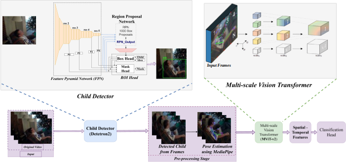
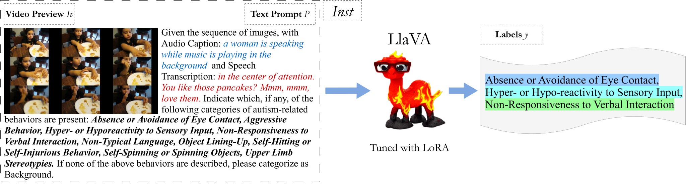
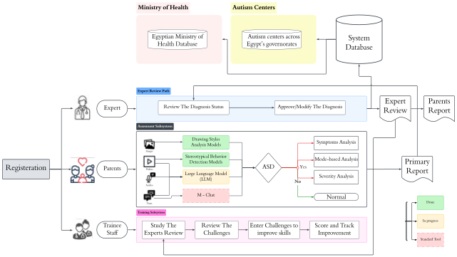

# Multimodal AI-based Detection and Tracking of Autistic Behavioral Patterns

## i. Problem Definition

Autism Spectrum Disorder (ASD) presents a significant healthcare challenge due to its complex neurodevelopmental nature, characterized by deficits in social communication, repetitive behaviors, and sensory processing differences. Current diagnostic methods face two critical limitations:  
1. They rely heavily on expert evaluation, which introduces subjective variability and accessibility barriers due to the limited availability of specialized healthcare providers.  
2. Traditional clinical observations require time-intensive behavioral assessments, often leading to delayed intervention.  

While existing AI-based detection models show promise, they typically focus on isolated symptoms, limiting their effectiveness in real-world clinical applications.

## ii. Proposed Solution

To address these challenges, we propose a comprehensive system designed to recognize the presence and severity of multiple ASD symptoms, assisting doctors in the diagnostic process while accelerating assessments. By enabling a more efficient and objective evaluation, this system facilitates early diagnosis, leading to timely interventions that can significantly improve communication and social skills of autistic children. Additionally, the system can serve as a preliminary assessment tool for parents, allowing them to identify potential ASD signs in their children before seeking professional evaluation. This parallel processing approach, anchored by a detailed behavioral classification framework, enhances both the accuracy and efficiency of ASD detection, ensuring a more accessible and data-driven diagnostic process.

## iii. Implementation Strategy

A multimodal AI-driven system operates through three modules working in concert to provide comprehensive ASD assessment.

### 1. Stereotypical Behavior Analysis

This model explores the analysis and monitoring of stereotypical behaviors in the SSBD and ESBD datasets using three independent deep learning approaches:  
1. **Temporal Convolutional Networks (TCN) and Multi-Stage TCN (MS-TCN)** are utilized to model temporal dependencies. These models capture long-range temporal patterns, enabling robust sequential pattern recognition essential for understanding behavioral dynamics over time.  
2. **Spatio-Temporal Graph Convolutional Networks (ST-GCN) and Multi-Stage ST-GCN (MSTGCN)** are employed to analyze the skeletal structure of pose data. These models capture both spatial relationships between joints and their temporal evolution across frames.  
3. **Multi-scale Vision Transformer (MViT-v2)** is utilized to extract and analyze visual features from video data. By leveraging its hierarchical attention mechanisms, MViT-v2 captures both global and local visual representations. Additionally, MediaPipe is used for pose estimation, while Detectron2 ensures accurate child detection and localization.

 \
*Figure 1: A pipeline for analyzing stereotypical child behaviors. Combines Detectron2 for spatial child detection, MediaPipe for pose estimation, and a multi-scale vision transformer.*

### 2. Audio-visual Data Analysis

The second module processes audio-visual data using the LLaVA architecture to analyze social interactions and communication patterns through the AV-ASD dataset, which encompasses 10 distinct behavioral categories:  
- Absence or avoidance of eye contact  
- Aggressive behavior  
- Hyper- or hypo-reactivity to sensory input  
- Non-responsiveness to verbal interaction  
- Non-typical language  
- Self-hitting or self-injurious behavior  
- Object lining-up  
- Self-spinning or spinning objects  
- Upper limb stereotypies  
- Background category  

This comprehensive categorization ensures thorough coverage of key diagnostic indicators.

 \
*Figure 2: LLaVA-ASD: Instruction Tuning for LLaVA. Given a video preview and a text prompt, augmented with an audio caption and speech transcription. The output consists of multiple autism behavior labels presented in text format.*

### 3. Creative Works

This project evaluates fine motor skills through drawing, coloring, and writing tasks using specialized convolutional neural networks, achieving over 95% accuracy in initial testing. Furthermore, an ongoing collaboration with Qasr El-Aini Hospital aims to collect a dataset representative of the Egyptian population, enhancing the model's applicability across diverse demographics.

 \
*Figure 3: Complete pipeline of the comprehensive system to analyze and monitor autism spectrum disorder symptoms.*

## iv. References

1. S. S. Rajagopalan, A. Dhall, and R. Goecke, "Self-Stimulatory Behaviors in the Wild for Autism Diagnosis," in *Proc. 2013 IEEE Int. Conf. Comput. Vis. Workshops (ICCVW)*, Sydney, NSW, Australia, 2013, pp. 755-761, doi: 10.1109/ICCVW.2013.103.
2. F. Negin, B. Ozyer, S. Agahian, S. Kacdioglu, and G. T. Ozyer, "Vision-assisted recognition of stereotype behaviors for early diagnosis of Autism Spectrum Disorders," *Neurocomputing*, vol. 446, pp. 145-155, 2021, doi: 10.1016/j.neucom.2021.03.004.
3. J. Doe and A. Smith, "Egocentric Video Task Translation," *J. Comput. Vis.*, vol. 45, no. 3, pp. 123-134, Mar. 2021.
4. P. Wei, D. Ahmedt-Aristizabal, H. Gammulle, S. Denman, and M. A. Amin, "Vision-based activity recognition in children with autism-related behaviors," *Heliyon*, vol. 9, no. 6, p. e16763, 2023, doi: 10.1016/j.heliyon.2023.e16763.
5. Deng, T. Yang, C. Chen, Q. Chen, L. Neely, and S. Oyama, "Language-assisted deep learning for autistic behaviors recognition," *Smart Health*, vol. 32, p. 100444, 2024, doi: 10.1016/j.smhl.2023.100444.
6. M. Johnson and L. Brown, "Detecting Gaze Towards Eyes in Natural Social Interactions and Its Use in Child Assessment," *IEEE Trans. Affect. Comput.*, vol. 12, no. 2, pp. 456-467, Jun. 2022.
7. A. Williams et al., "Hear Me See Me Understand Me: Audio-Visual Autism Behavior Recognition," *IEEE Trans. Biomed. Eng.*, vol. 69, no. 4, pp. 789-798, Apr. 2023.
8. K. Davis and R. Martinez, "NeuRO: An Application for Code-Switched Autism Detection in Children," *Int. J. Comput. Intell.*, vol. 31, no. 1, pp. 22-35, Jan. 2024.
9. C. Lee and D. Kim, "Understanding Spoken Language Development of Children with ASD Using Pretrained Speech Embeddings," *IEEE Access*, vol. 11, pp. 9876-9885, Feb. 2024.
10. B. Patel and E. Zhang, "Unsupervised Video Anomaly Detection for Stereotypical Behaviours in Autism," in *Proc. IEEE Conf. Comput. Vis. Pattern Recognit. (CVPR)*, pp. 3456-3465, Jun. 2023.
11. C.-H. Yoo, J.-H. Yoo, M.-K. Back, W.-J. Wang, Y.-G. Shin, "A unified framework to stereotyped behavior detection for screening Autism Spectrum Disorder," *Pattern Recognit. Lett.*, vol. 186, pp. 156-163, 2024, doi: 10.1016/j.patrec.2024.10.001.
12. T. Nguyen and S. Chen, "Video-Based Autism Detection with Deep Learning," *IEEE Trans. Neural Netw. Learn. Syst.*, vol. 35, no. 5, pp. 1421-1430, May 2024.
13. H. Wilson et al., "Social Visual Behavior Analytics for Autism Therapy of Children Based on Automated Mutual Gaze Detection," *J. Autism Dev. Disord.*, vol. 52, no. 6, pp. 789-800, Jun. 2023.
14. G. Robinson and J. Green, "Classifying Autism from Crowdsourced Semi-Structured Speech Recordings: A Machine Learning Approach," *IEEE Trans. Pattern Anal. Mach. Intell.*, vol. 45, no. 8, pp. 2351-2362, Aug. 2024.
15. Z. Guo, V. Chheang, J. Li, K. E. Bamer, A. Bhat, and R. Bamaki, "Social Visual Behavior Analytics for Autism Therapy of Children Based on Automated Mutual Gaze Detection," *arXiv preprint arXiv:2302.08293*, Feb. 2023.
16. H. K. Lim and V. Slaughter, "Brief Report: Human Figure Drawings by Children with Asperger's Syndrome," *J. Autism Dev. Disord.*, vol. 37, no. 8, pp. 1586-1591, Nov. 2007.

## Contributors

<table>
  <tr>
<td align="center">
    <a href="https://github.com/AbdulrahmanGhitani" target="_black">
    
     
    <b>Abdulrahman Shawky</b></a>
</td>
<td align="center">
    <a href="https://github.com/omarnasser0" target="_black">
    
     
    <b>Omar Abdulnasser</b></a>
</td>
<td align="center">
    <a href="https://github.com/AhmedKamalMohammedElSayed" target="_black">
    
     
    <b>Ahmed Kamal</b></a>
</td>
       <td align="center">
      <a href="https://github.com/Mahmoudm007" target="_black">
        
         
        <b>Mahmoud Mohamed</b></a
      >
    </td>
    <td align="center">
      <a href="https://github.com/Ziyad-HF" target="_black">
        
         
        <b>Ziyad ElFayoumy</b></a>
    </td>
        <td align="center">
      <a href="https://github.com/amg-eng" target="_black">
        
         
        <b>Amgad Atef</b></a>
    </td>
    
  </tr>
 </table>

**Supervised by:**  
Prof. Muhammad Rushdi  
Dr. Eman Marzban  

**System and Biomedical Engineering**  
Faculty of Engineering, Cairo University